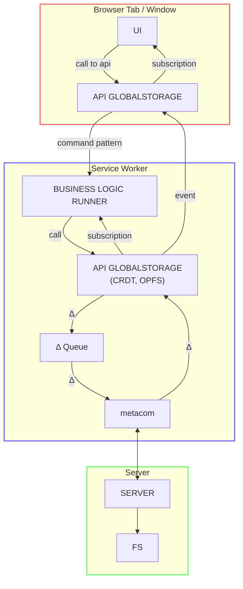
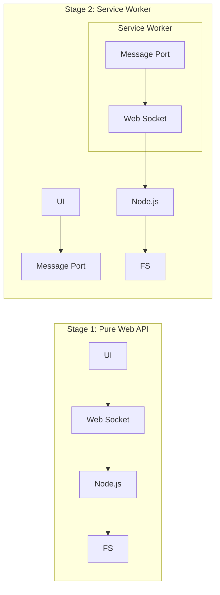
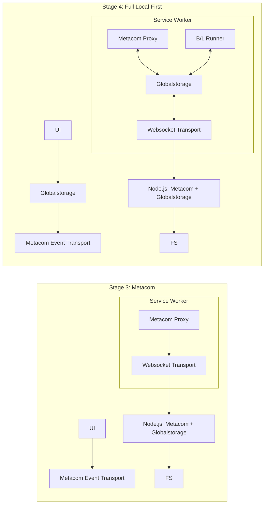
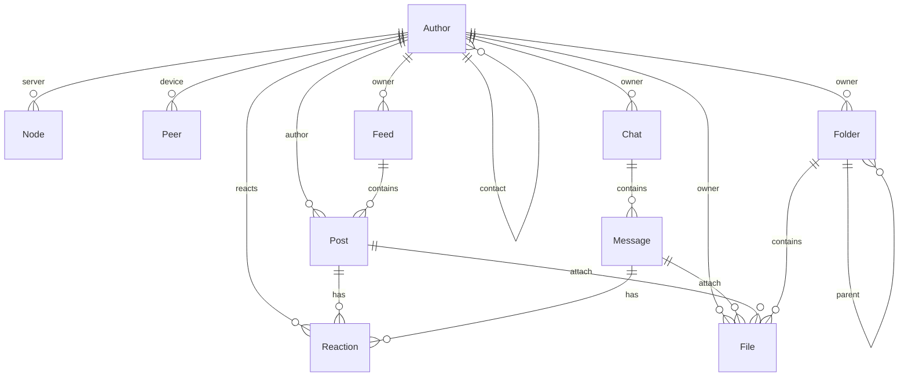

# XXII Chat Diagrams

This file contains text-based representations of the project's architecture and data models, converted from image diagrams. These schemes are compatible with Mermaid-capable viewers and AI tools.

## 1. Calls and Data Flow Diagram `./calls_and_data_flow_diagram.md`

This diagram represents the interaction between the browser tab, service worker, and the server in the local-first architecture.



<details><summary>Plain-text version</summary>

```
┌─── Browser Tab / Window ────────────────────────┐
│                                                  │
│   UI  ── call to api ──▶  API GLOBALSTORAGE      │
│   UI  ◀── subscription ──  API GLOBALSTORAGE     │
│                                                  │
└──────────────────────────────────────────────────┘
        ▲ subscription / event │  ▲ command pattern
        │                      ▼  │
┌─── Service Worker ──────────────────────────────┐
│                                                  │
│   API GLOBALSTORAGE  ◀── call ── B/L RUNNER      │
│     (CRDT, OPFS)     ── subscription ──▶         │
│         │                                        │
│         ▼ Δ                                      │
│      Δ Queue  ── Δ ──▶  metacom  ◀── Δ ──┘      │
│                            │                     │
└────────────────────────────│─────────────────────┘
                             │
┌─── Server ─────────────────│─────────────────────┐
│                            ▼                     │
│                         SERVER  ──▶  FS          │
│                                                  │
└──────────────────────────────────────────────────┘
```

</details>

## 2. Architectural Evolution `./chat_prototype_phases.jpg`

The evolution of the XXII Chat architecture from a simple Web API to a full local-first system with synchronization.

### Stage 1 & 2: Basic Connection & Service Worker



### Stage 3 & 4: Metacom & Local-First Sync



## 3. Entity Relationshil Diagram `./entity_relationship_diagram.md`

The relationship between core domain entities in the XXII Chat system.



<details><summary>Plain-text version</summary>

```
                        ┌──────────┐
                ┌──────▶│  Author  │◀─── contact (self)
                │       └────┬─────┘
                │            │ owns / authors
        server  │    ┌───┬───┼───┬───────┬───────┐
                │    │   │   │   │       │       │
            ┌───┘  ┌─▼─┐ │ ┌─▼─┐ │   ┌───▼──┐ ┌──▼──┐
            │ Node │  │ │Chat│ │   │Folder│ │File │
            └─────┘  │ └───┘ │   └──┬───┘ └─────┘
                     │       │      │ parent (self)
              device │       │      │ contains ──▶ File
            ┌──────┐ │       │
            │ Peer │◀┘       │
            └──────┘     ┌───▼──┐      ┌──────────┐
                         │ Feed │──────▶│   Post   │
                         └──────┘       └────┬─────┘
                                             │ attach ──▶ File
                                             │ has
                  ┌─────────┐           ┌────▼─────┐
           Chat ──│ Message │──attach──▶│   File   │
                  └────┬────┘           └──────────┘
                       │ has
                  ┌────▼─────┐
                  │ Reaction │
                  └──────────┘
```

**Relationships:**

| From    | To       | Relation | Cardinality |
| ------- | -------- | -------- | ----------- |
| Author  | Author   | contact  | one-to-many |
| Author  | Node     | server   | one-to-many |
| Author  | Peer     | device   | one-to-many |
| Author  | Feed     | owner    | one-to-many |
| Author  | Chat     | owner    | one-to-many |
| Author  | Folder   | owner    | one-to-many |
| Author  | File     | owner    | one-to-many |
| Author  | Post     | author   | one-to-many |
| Author  | Reaction | reacts   | one-to-many |
| Feed    | Post     | contains | one-to-many |
| Chat    | Message  | contains | one-to-many |
| Post    | Reaction | has      | one-to-many |
| Message | Reaction | has      | one-to-many |
| Message | File     | attach   | one-to-many |
| Post    | File     | attach   | one-to-many |
| Folder  | Folder   | parent   | one-to-many |
| Folder  | File     | contains | one-to-many |

</details>
